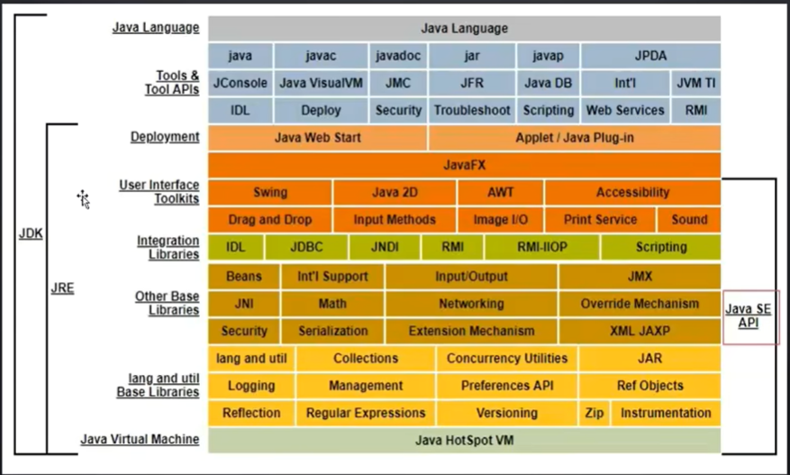
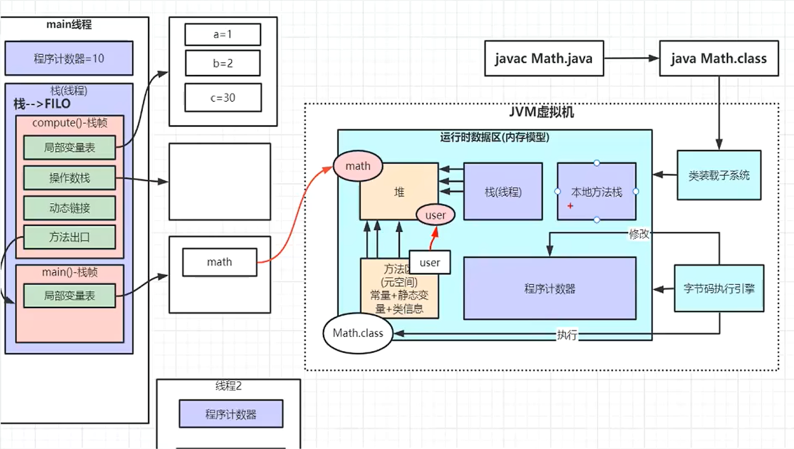
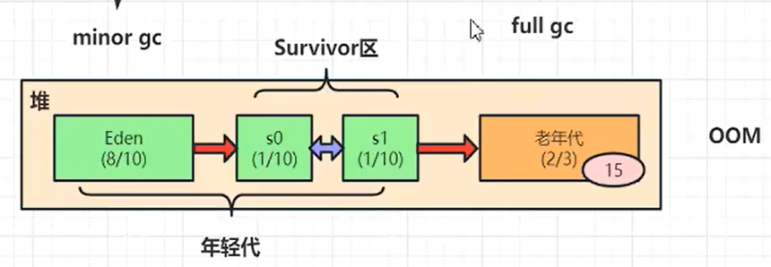

# JVM组成

## 堆
* 放置对象

## 栈(线程)
* 放置对象的局部变量(局部变量也可能会是对象, 其存放在堆里)
* 只要执行方法, 就会在栈中开辟内存供其使用
* 一个方法对应一块栈帧内存区
### 局部变量表
* 放局部变量的数据结构(内存地址)
### 操作数栈
* 存放数值
### 动态链接
* 将符号(即方法名, 参数名)引用转变为直接引用(即内存里的地址)
### 方法出口
* 当当前线程执行完毕后, 记录继续在上一个线程中的哪个地址继续向下执行
## 本地方法栈
* 运行本地方法的内存
## 方法区(元空间)
* 放置常量, 静态变量, 类信息
* 加载字节码文件的区域, 由字节码引擎进行执行
## 程序计数器
* 存放即将要执行的代码在内存中的地址
* 由字节码引擎进行修改
